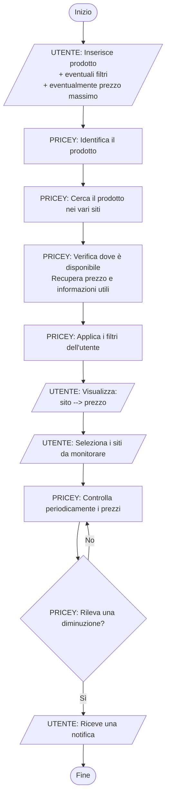
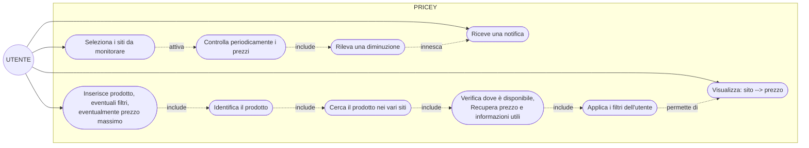

# 1. Diagramma di flusso

```mermaid
flowchart TD
    Start([Inizio]) --> A[/UTENTE: Inserisce prodotto\n+ eventuali filtri\n+ eventualmente prezzo massimo/]
    A --> B[PRICEY: Identifica il prodotto]
    B --> C[PRICEY: Cerca il prodotto nei vari siti]
    C --> D[PRICEY: Verifica dove è disponibile\nRecupera prezzo e informazioni utili]
    D --> E[PRICEY: Applica i filtri dell'utente]
    E --> F[/UTENTE: Visualizza:\nsito --> prezzo/]
    F --> G[/UTENTE: Seleziona i siti da monitorare/]
    G --> H[PRICEY: Controlla periodicamente i prezzi]
    H --> I{PRICEY: Rileva una diminuzione?}
    I -- Sì --> J[/UTENTE: Riceve una notifica/]
    I -- No --> H
    J --> End([Fine])
```

# 2. Diagramma dei casi d'uso

```mermaid
flowchart LR
    U((UTENTE))

    subgraph PRICEY
        UC1([Inserisce prodotto, eventuali filtri,\neventualmente prezzo massimo])
        UC2([Visualizza: sito --> prezzo])
        UC3([Seleziona i siti da monitorare])
        UC4([Riceve una notifica])

        Sys1([Identifica il prodotto])
        Sys2([Cerca il prodotto nei vari siti])
        Sys3([Verifica dove è disponibile,\nRecupera prezzo e informazioni utili])
        Sys4([Applica i filtri dell'utente])
        Sys5([Controlla periodicamente i prezzi])
        Sys6([Rileva una diminuzione])
    end

    U --> UC1
    U --> UC2
    U --> UC3
    U --> UC4

    UC1 -. "include" .-> Sys1
    Sys1 -. "include" .-> Sys2
    Sys2 -. "include" .-> Sys3
    Sys3 -. "include" .-> Sys4
    Sys4 -. "permette di" .-> UC2
    
    UC3 -. "attiva" .-> Sys5
    Sys5 -. "include" .-> Sys6
    Sys6 -. "innesca" .-> UC4
```